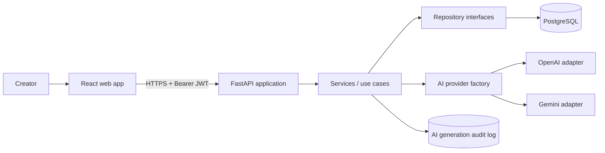

# Project Structure and Architecture

## 1. Chosen stack

| Layer | Choice | Reason |
|---|---|---|
| Web | React, TypeScript, Vite, Tailwind CSS | Fast development, typed components, straightforward SPA deployment |
| API | FastAPI, Pydantic, SQLAlchemy, Alembic | Typed contracts, automatic OpenAPI docs, strong Python AI ecosystem |
| Data | PostgreSQL | JSONB for outlines, transactions, production-ready relational model |
| Auth | JWT access tokens, Argon2 password hashes | Matches the SRS and supports stateless API authentication |
| AI | Provider interface with OpenAI and Gemini adapters | Meets Factory Method requirement and prevents provider lock-in |
| Runtime | Docker Compose | Reproducible local and demonstration environment |
| Delivery | GitHub Actions and Terraform | Automated quality gates and repeatable cloud infrastructure |

Use SQLite only for isolated unit tests. PostgreSQL remains the development and production source of truth so JSONB, constraints, and migrations behave consistently.

## 2. Three-tier architecture



The API router handles HTTP concerns, services enforce business rules and ownership, repositories perform persistence, and provider adapters translate one internal AI contract into vendor-specific calls.

## 3. Repository layout

```text
.
|-- backend/
|   |-- app/
|   |   |-- api/v1/          # route modules and request dependencies
|   |   |-- core/            # settings, JWT, password hashing, errors
|   |   |-- db/              # session, base class, migrations
|   |   |-- models/          # SQLAlchemy entities
|   |   |-- schemas/         # Pydantic request/response contracts
|   |   |-- repositories/    # repository interfaces and SQL implementations
|   |   |-- services/        # auth, projects, ideas, outlines, drafts
|   |   |-- ai/              # provider interface, factory, prompts, adapters
|   |   `-- main.py
|   |-- tests/
|   |-- alembic/
|   |-- Dockerfile
|   `-- pyproject.toml
|-- frontend/
|   |-- src/
|   |   |-- api/             # typed HTTP client
|   |   |-- components/      # UI building blocks
|   |   |-- features/        # auth, projects, studio, editor
|   |   |-- pages/           # route-level screens
|   |   |-- store/           # auth/session state
|   |   `-- types/
|   |-- Dockerfile
|   `-- package.json
|-- infra/terraform/          # cloud-neutral module boundaries
|-- docs/
|-- .github/workflows/ci.yml
|-- compose.yaml
`-- .env.example
```

## 4. Domain model

| Entity | Important fields | Rules |
|---|---|---|
| users | id UUID, full_name, email, password_hash, role, timestamps | normalized unique email; hash only |
| projects | id, user_id, title, description, platform, content_type, audience, tone | every query constrained by user_id |
| content_ideas | id, project_id, title, summary, hook, platform, selected | deleted with project |
| outlines | id, project_id, idea_id, title, outline_data JSONB, version | idea must belong to same project |
| drafts | id, project_id, outline_id, title, content, format, version | optimistic version check on update |
| ai_generations | id, user_id, project_id, type, provider, model, status, tokens, latency_ms, error_code | metadata only; avoid secrets and sensitive prompts |

Recommended indexes: `users(lower(email))`, `projects(user_id, updated_at desc)`, child table `project_id` columns, and `ai_generations(user_id, created_at desc)`. All foreign keys use `ON DELETE CASCADE` except audit records, whose project reference may be nullable if retention is required.

## 5. Main user flow

1. Register or sign in; the API returns a short-lived access token.
2. Create a project with platform, content type, audience, and tone.
3. Generate 3-10 ideas. The service validates structured AI output and persists the accepted list in one transaction.
4. Select an idea and generate an outline using a platform-specific prompt template.
5. Generate a draft from the saved outline.
6. Edit and save the draft with a version number to prevent accidental overwrites.
7. Reopen the project and continue from any saved stage.

## 6. Screens

| Route | Purpose |
|---|---|
| `/register`, `/login` | account access and validation |
| `/projects` | list, create, and delete owned projects |
| `/projects/:id` | metadata and workflow progress |
| `/projects/:id/ideas` | generation inputs and selectable idea cards |
| `/projects/:id/outline` | editable structured outline |
| `/projects/:id/draft` | rich text editor, save state, generation status |

## 7. State and failure handling

- Treat AI generation as a request with `pending`, `succeeded`, or `failed` status.
- Attach an idempotency key to generate actions to avoid duplicate records after retries.
- Use bounded provider timeouts and retry only rate limits and transient 5xx failures with jitter.
- Validate every AI response against a Pydantic schema before persistence.
- Return stable error objects: `{code, message, request_id, details?}`.
- For the MVP, use normal HTTP requests. Add Server-Sent Events later if token streaming materially improves the editor experience.
